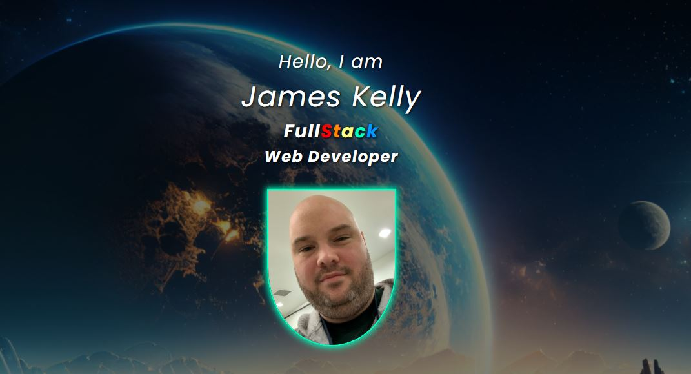

<h2 align="center"><a href="https://jk377y.dev" target="_blank">jk377y.dev</a></h2>

<h3 align="center"><em>~ I didn't come this far just to come this far. ~ </em></h3>

<h3 align="center">
&emsp;&emsp;Hello World! My name is James Kelly and I am a Full Stack Web Developer who is ready to take the industry by storm! I am thrilled to be a part of this exciting field and I am always on the lookout for new opportunities to showcase my skills.
</h3>

<h3 align="center">
&emsp;&emsp;With my energy, enthusiasm, and drive, I am confident that I will make a valuable addition to any team. I am ready to roll up my sleeves and get to work on exciting projects that push the boundaries of what is possible in web development. Let's make something amazing together!</h3>

  

  

<h2 align="center">Connect with me:</h2>

&emsp;&emsp;&emsp;&emsp;

 
 
<h3 align="center">

<!-- **Most Recent Project**

<h3 align="center">Using these technologies:</h3>

 
&nbsp;
&nbsp;
&nbsp;
&nbsp;

 
 
  -->

</h3>
 
<h1 align="center">My Skills, Languages and Tools:</h1>

 
&nbsp; 
&nbsp; 
&nbsp; 
&nbsp;
&nbsp;  
&nbsp; 
&nbsp; 
&nbsp; 
&nbsp; 

  
&nbsp; 
&nbsp; 
&nbsp; 
&nbsp;
&nbsp;
&nbsp;
&nbsp;
&nbsp;
&nbsp;

 
 
 
 

